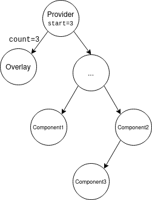

# react-count-down-latch

A simple "count down latch" implementation for React applications where deeply nested components take a while to render due to blocking IO operations like API communication, and you want to overlay a pre-loader to the user in front of the busy components.

## Setup

Installation:

`npm install react-count-down-latch --save`

## Sample Usage

```tsx
import ReactDom from 'react-dom/client';
import * as ReactCountDownLatch from '../../src';
import React, { useEffect } from 'react';

const sleep = (m: number) => new Promise(r => setTimeout(r, m));

const SomeDeeplyNestedComponent = ({ takesMsToLoad }: { takesMsToLoad: number }): JSX.Element => {
  const { countDown } = ReactCountDownLatch.useCountDownLatch();

  useEffect(() => void sleep(takesMsToLoad).then(countDown), []);

  return (<p>A component that takes a while to render</p>);
};

const App = (): JSX.Element => {
  return (<ReactCountDownLatch.Provider start={3}>
    <ReactCountDownLatch.Overlay>
      <div>
        <h1>A pre-loader overlay</h1>
      </div>
    </ReactCountDownLatch.Overlay>
    <SomeDeeplyNestedComponent takesMsToLoad={2000} />
    <SomeDeeplyNestedComponent takesMsToLoad={2500} />
    <SomeDeeplyNestedComponent takesMsToLoad={1000} />
  </ReactCountDownLatch.Provider>);
};

const root = ReactDom.createRoot(document.getElementById('root') as HTMLElement);
root.render(App());
```

`react-count-down-latch` makes it simple to implement a pre-loader overlay in front of components that take time to render, without passing callbacks down the tree, or maintaining some other kind of state yourself manually (such as Redux).

**Note:** You are responsible for styling the overlay yourself, all the `Overlay` component is responsible for is hiding and showing its children.

## API

### `Provider`

The components you want to overlay should be children of this context provider, you can have multiple instances of this provider.

**Properties (props)**

| Prop | Type | Description
-- | -- | --
| `start` | number | The total number of child components which will call `countDown()`


### `Overlay`

You should define the overlay you wish to show to users inside this component, it should (ideally) be the first child of a `Provider` context.


### `useCountDownLatch()`

**Return values**

| Name | Type | Description 
-- | -- | --
|  `count` | `number` | The current value of the counter. For the most part, this is an implementation detail you can ignore - unless you wish to use it within the pre-loader overlay for tracking progress.
| `countDown` | `() => void` | Invoking this function will reduce the 'latch' by 1. This should be called when your component has finished any long-running tasks and is ready to render.

## Demo

You can view the live demo [here]().

## Control Flow



